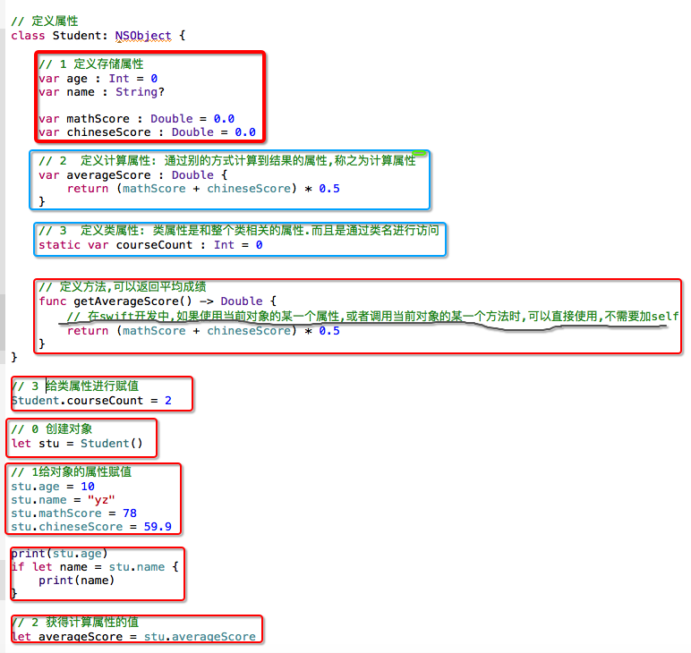

# Class-Property

- 定义存储属性
- 定义计算属性: 通过别的方式计算到结果的属性,称之为计算属性
    - 计算属性并不存储实际的值，而是提供一个getter和一个可选的setter来间接获取和设置其它属性
- 定义类属性: 类属性是和整个类相关的属性.而且是通过类名进行访问

- 在swift开发中,如果使用当前对象的某一个属性,或者调用当前对象的某一个方法时,可以直接使用,不需要加self

