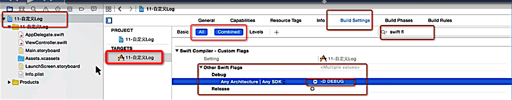
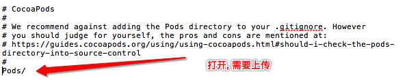
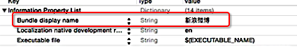

## Weibo-Sina

- 自定义Log

```swift
func LMJLog<T>(message: T, file: String = __FILE__, funcName: String = __FUNCTION__, lineNum: Int = __LINE__)
{
    #if DEBUG

        let fileName = (file as NSString).lastPathComponent
        print("\(fileName)-[\(funcName)] (\(lineNum)): \(message)")

    #endif
}
```

- 配置DEBUG的`宏`环境




- 添加忽略文件的时候的pods的配置




- 应用展示的名字




