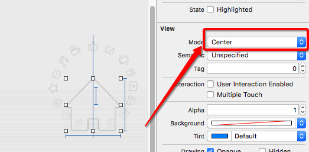

# SecondDay

### 一, 异常处理

- 如果在调用系统某一个方法时,该方法最后有一个throws.说明该方法会抛出异常.
- 如果一个方法会抛出异常,那么需要对该异常进行处理
- 在swift中提供三种处理异常的方式

- 方式一:try方式 程序员手动捕捉异常

```swift
        do {
          let regex = try NSRegularExpression(pattern: pattern, options: .CaseInsensitive)
        } catch {
            print(error)
        }
```

-  方式二:try?方式(常用方式) 系统帮助我们处理异常,如果该方法出现了异常,则该方法返回nil.
-  如果没有异常,则返回对应的对象

```swift
        guard let regex0 = try? NSRegularExpression(pattern: pattern, options: .CaseInsensitive) else {
            return
        }
```

- 方式三:try!方法(不建议,非常危险) 直接告诉系统,该方法没有异常.
- 注意:如果该方法出现了异常,那么程序会报错(崩溃)

```swift
let regex1 = try! NSRegularExpression(pattern: pattern, options: .CaseInsensitive)
```

### 二, 根据字符串创建类对象

```swift
        // 0.获取命名空间
        guard let nameSpace = NSBundle.mainBundle().infoDictionary!["CFBundleExecutable"]
                                as? String else {
            print("没有获取命名空间")
            return
        }

        // 1.根据字符串获取对应的Class
        guard let anyClass = NSClassFromString(nameSpace + "." + childVcName) else {
            print("没有获取到字符串对应的Class")
            return
        }

        // 2.将对应的AnyClass转成控制器的类型
        guard let childVcType = anyClass as? UIViewController.Type else {
            print("没有获取对应控制器的类型")
            return
        }

        // 3.创建对应的控制器对象
        let childVc = childVcType.init()
```

### 三, 类方法
- swift中类方法是以class开头的方法.类似于OC中+开头的方法

```swift
    class func createButton(imageName : String, bgImageName : String) -> UIButton {
        // 1.创建btn
        let btn = UIButton()

        // 2.设置btn的属性
        btn.setImage(UIImage(named: imageName), forState: .Normal)

        btn.sizeToFit()

        return btn
    }

// 外边怎么用
    private lazy var composeBtn : UIButton = UIButton.createButton("tabbar_compose_icon_add", bgImageName: "tabbar_compose_button")
```


### swift中的SEL和事件监听

- Selector两种写法: 1>Selector("composeBtnClick") 2> "composeBtnClick"
- 事件监听本质发送消息.但是发送消息是OC的特性
- 将方法包装成@SEL --> 类中查找方法列表 --> 根据@SEL找到imp指针(函数指针) --> 执行函数
- 如果swift中将一个函数声明称private,那么该函数不会被添加到方法列表中
- 如果在private前面加上@objc,那么该方法依然会被添加到方法列表中

```swift
composeBtn.addTarget(self, action: "composeBtnClick", forControlEvents: .TouchUpInside)

@objc private func composeBtnClick() {
        print("composeBtnClick")
    }
```

###访客视图中的icon的缩放问题


###animation
```swift
        // 1.创建动画
        let rotationAnim = CABasicAnimation(keyPath: "transform.rotation.z")

        // 2.设置动画的属性
        rotationAnim.fromValue = 0
        rotationAnim.toValue = M_PI * 2
        rotationAnim.repeatCount = MAXFLOAT
        rotationAnim.duration = 5
        rotationAnim.removedOnCompletion = false

        // 3.将动画添加到layer中
        rotationView.layer.addAnimation(rotationAnim, forKey: nil)
```

###initWithFame的注意点
- swift中规定:重写控件的`init(frame方法)`或者init()方法,必须重写`init?(coder aDecoder: NSCoder)`

```swift
    // MARK:- 重写init函数
    override init(frame: CGRect) {
        super.init(frame : frame)
    }

    // swift中规定:重写控件的init(frame方法)或者init()方法,必须重写init?(coder aDecoder: NSCoder)
    required init?(coder aDecoder: NSCoder) {
        fatalError("init(coder:) has not been implemented")
    }
```

###modal后的控制器的view的背后仍然显示其他控制器控件

```swift
// 2.创建弹出的控制器
        let popoverVc = PopoverViewController()

        // 3.设置控制器的modal样式
        popoverVc.modalPresentationStyle = .Custom

        // 4.弹出控制器
        presentViewController(popoverVc, animated: true, completion: nil)
```

